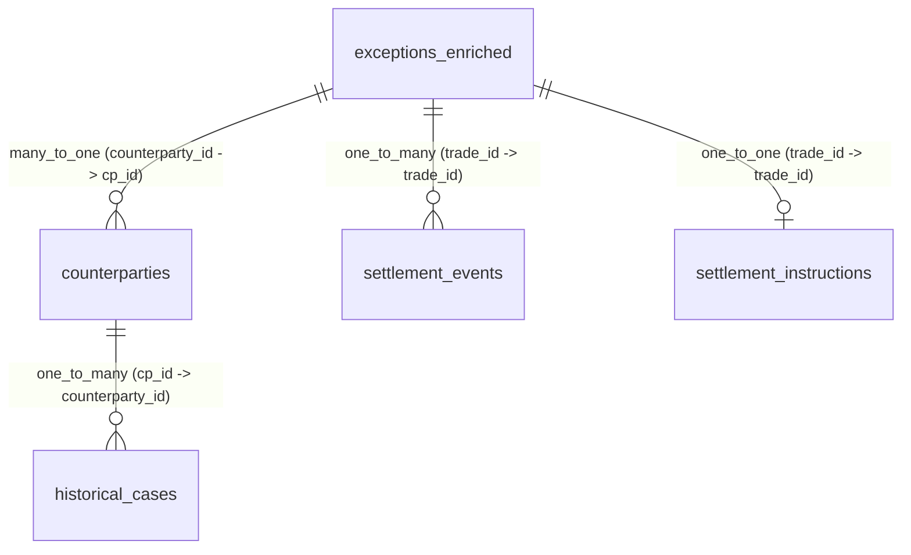

# Snowflake Cortex Analyst — Semantic Model & Validation Guide (Milestone 3)

## Overview

This document specifies the architecture, semantic definitions, relationship graph, and validation procedures for the **ClearSet AI Cortex Analyst Semantic Layer**.

The semantic model translates natural-language queries from post-trade operations analysts and desk managers into high-accuracy SQL statements evaluated directly against Snowflake structured data views and tables.

---

## 1. Semantic Model Structure

The semantic model is formally codified in [`snowflake/07_semantic_model.yaml`](file:///e:/coco-cli/clearset-ai/snowflake/07_semantic_model.yaml).

### Logical Tables & Underlying Snowflake Objects

| Logical Table | Underlying Snowflake Object | Business Purpose |
| :--- | :--- | :--- |
| **`exceptions_enriched`** | [`V_EXCEPTIONS_ENRICHED`](file:///e:/coco-cli/clearset-ai/snowflake/03_semantic_views.sql#L9) | Main operational triage queue linking exceptions to trade economics, securities, counterparties, SSIs, and cutoff deadlines. |
| **`counterparties`** | [`COUNTERPARTIES`](file:///e:/coco-cli/clearset-ai/snowflake/01_schema.sql#L13) | Master directory of trading firms, credit ratings, 30-day failure counts, historical fail rates, and escalation contacts. |
| **`settlement_events`** | [`V_SETTLEMENT_EVENTS`](file:///e:/coco-cli/clearset-ai/snowflake/03_semantic_views.sql#L92) | Chronological audit trail of SWIFT messages (MT541, MT548, MT599, ISO 20022) and depository events. |
| **`historical_cases`** | [`V_HISTORICAL_CASES`](file:///e:/coco-cli/clearset-ai/snowflake/03_semantic_views.sql#L145) | Institutional playbook memory containing prior root causes, applied SOP rules, resolution steps, and CSDR penalties avoided. |
| **`settlement_instructions`** | [`V_SSI_STATUS`](file:///e:/coco-cli/clearset-ai/snowflake/03_semantic_views.sql#L167) | Standing Settlement Instructions (SSI), depository participant IDs, safekeeping accounts, and mismatch details. |

---

## 2. Relationships Graph

The logical tables are connected through foreign-key relationships defined in the YAML:



1. **`exception_to_counterparty`** (`exceptions_enriched.counterparty_id` $\rightarrow$ `counterparties.cp_id`): Many-to-One join enabling counterparty failure analysis from any exception.
2. **`exception_to_settlement_events`** (`exceptions_enriched.trade_id` $\rightarrow$ `settlement_events.trade_id`): One-to-Many join for timeline reconstruction.
3. **`counterparty_to_historical_cases`** (`counterparties.cp_id` $\rightarrow$ `historical_cases.counterparty_id`): One-to-Many join retrieving previous resolution playbooks for the same counterparty.
4. **`exception_to_settlement_instructions`** (`exceptions_enriched.trade_id` $\rightarrow$ `settlement_instructions.trade_id`): One-to-One join detailing custodian BIC, depository subaccounts, and mismatch notes.

---

## 3. Business Dimensions & Measures

### Key Dimensions
- **`exception_id` / `trade_id`**: Operational identifiers (e.g. `EX-92831`, `TRD-92831`).
- **`severity`**: Triage classifications (`CRITICAL`, `HIGH`, `MEDIUM`, `LOW`).
- **`exception_status`**: Case lifecycle state (`OPEN`, `INVESTIGATING`, `PENDING_APPROVAL`, `RESOLVED`).
- **`exception_type`**: Root failure category (`Missing Instruction`, `Cash Discrepancy`, `Counterparty Fail Risk`).
- **`ticker` / `security_name` / `asset_class`**: Instrument details (`AAPL`, `UST10Y`, `Equities`, `Fixed Income`).
- **`depository`**: Central settlement venue (`DTC`, `Fedwire`, `Euroclear`).
- **`counterparty_name` / `counterparty_id`**: Trading firm (`Apex Prime Clearing Ltd.`, `CP-192`).
- **`ssi_status`**: Instruction affirmation state (`MISSING`, `MISMATCHED`, `PENDING`, `MATCHED`).
- **`credit_rating`**: Institutional credit rating (`A`, `AAA`, `AA+`).
- **`message_type` / `event_status`**: SWIFT/depository event states (`SWIFT MT541`, `SWIFT MT548`, `SSI_NOT_FOUND`, `CRITICAL_RISK_FLAGGED`).
- **`root_cause` / `applied_procedure`**: Historical failure rationale and standard operating procedure citation (e.g. `Settlement Exception SOP §3.2`).

### Key Measures & Metrics
- **`risk_score`**: 0–100 explainable deterministic risk score calculated by ClearSet Risk Engine (`default_aggregation: max`).
- **`trade_value`**: Gross notional monetary value in USD (`default_aggregation: sum`).
- **`minutes_to_cutoff`**: Minutes remaining until depository market cutoff deadline (`default_aggregation: min`).
- **`prior_failures_30d`**: 30-day failure count for counterparty (`default_aggregation: sum`).
- **`historical_fail_rate`**: Rolling 30-day fail percentage (e.g. `8.4%`, `default_aggregation: avg`).
- **`avg_resolution_hours`**: Average turnaround hours to settle exceptions with this counterparty (`default_aggregation: avg`).
- **`csdr_penalty_avoided`**: Regulatory CSDR cash penalties avoided in USD (`default_aggregation: sum`).
- **`exception_count`**: Count of exception records (`default_aggregation: count`).

---

## 4. Required Natural-Language Questions & Ground-Truth SQL

Cortex Analyst translates user prompts into the following verified SQL queries:

### Question 1: *"Show me critical settlement exceptions approaching cutoff."*
```sql
SELECT 
    TRADE_ID, 
    TICKER, 
    COUNTERPARTY_NAME, 
    TRADE_VALUE, 
    MINUTES_TO_CUTOFF, 
    RISK_SCORE 
FROM CLEARSET_DB.CLEARSET_SCHEMA.V_EXCEPTIONS_ENRICHED
WHERE SEVERITY = 'CRITICAL' AND EXCEPTION_STATUS IN ('OPEN', 'INVESTIGATING')
ORDER BY RISK_SCORE DESC, MINUTES_TO_CUTOFF ASC;
```
**Expected Data Result:**
- `TRD-92831` ($2.4M AAPL, Apex Prime, Score: 91, Cutoff: 15:30 EST)
- `TRD-81232` ($8.1M UST10Y, Vanguard, Score: 89, Cutoff: 15:00 EST)
- `TRD-71292` ($1.2M NVDA, Goldman, Score: 86, Cutoff: 15:30 EST)

---

### Question 2: *"Why is TRD-92831 critical?"*
```sql
SELECT 
    TRADE_ID,
    TICKER,
    COUNTERPARTY_NAME,
    TRADE_VALUE,
    SSI_STATUS,
    MINUTES_TO_CUTOFF,
    PRIOR_FAILURES_30D,
    HISTORICAL_FAIL_RATE,
    RISK_SCORE,
    SEVERITY
FROM CLEARSET_DB.CLEARSET_SCHEMA.V_EXCEPTIONS_ENRICHED
WHERE TRADE_ID = 'TRD-92831';
```
**Expected Data Result:**
- Trade value: `$2,400,000.00` (> $1M tier)
- SSI status: `MISSING`
- Counterparty: `Apex Prime Clearing Ltd.` (`CP-192`) with `7 prior failures` (8.4% fail rate)
- Risk Score: `91/100` (`CRITICAL`)

---

### Question 3: *"Show me the settlement history for TRD-92831."*
```sql
SELECT 
    EVENT_ID,
    EVENT_TIMESTAMP,
    MESSAGE_TYPE,
    EVENT_STATUS,
    DESCRIPTION,
    SOURCE
FROM CLEARSET_DB.CLEARSET_SCHEMA.V_SETTLEMENT_EVENTS
WHERE TRADE_ID = 'TRD-92831'
ORDER BY EVENT_TIMESTAMP ASC;
```
**Expected Data Result:**
- 5 chronological events: Trade Booking (`EVT-101`) $\rightarrow$ SSI Lookup (`EVT-102`) $\rightarrow$ MT548 Exception (`EVT-103`) $\rightarrow$ Cutoff Warning (`EVT-104`) $\rightarrow$ Risk Flagged (`EVT-105`).

---

### Question 4: *"How many failures has CP-192 had in the last 30 days?"*
```sql
SELECT 
    CP_ID,
    NAME,
    PRIOR_FAILURES_30D,
    HISTORICAL_FAIL_RATE,
    AVG_RESOLUTION_HOURS
FROM CLEARSET_DB.CLEARSET_SCHEMA.COUNTERPARTIES
WHERE CP_ID = 'CP-192';
```
**Expected Data Result:**
- `PRIOR_FAILURES_30D`: `7`
- `HISTORICAL_FAIL_RATE`: `8.4%`
- `AVG_RESOLUTION_HOURS`: `4.2h`

---

### Question 5: *"What is the total exposure of open critical settlement exceptions?"*
```sql
SELECT 
    COUNT(EXCEPTION_ID) AS TOTAL_CRITICAL_EXCEPTIONS,
    SUM(TRADE_VALUE) AS TOTAL_GROSS_EXPOSURE_USD
FROM CLEARSET_DB.CLEARSET_SCHEMA.V_EXCEPTIONS_ENRICHED
WHERE SEVERITY = 'CRITICAL' AND EXCEPTION_STATUS IN ('OPEN', 'INVESTIGATING');
```
**Expected Data Result:**
- `TOTAL_CRITICAL_EXCEPTIONS`: `3` (`TRD-92831`, `TRD-81232`, `TRD-71292`)
- `TOTAL_GROSS_EXPOSURE_USD`: `$11,700,000.00` ($2.4M + $8.1M + $1.2M)

---

### Question 6: *"Show me historical cases similar to TRD-92831."*
```sql
SELECT 
    HISTORICAL_CASE_ID,
    ORIGINAL_TRADE_ID,
    CASE_DATE,
    COUNTERPARTY_NAME,
    ROOT_CAUSE,
    APPLIED_PROCEDURE,
    RESOLUTION_STRATEGY,
    TIME_TO_RESOLVE_HOURS,
    OUTCOME,
    CSDR_PENALTY_AVOIDED
FROM CLEARSET_DB.CLEARSET_SCHEMA.V_HISTORICAL_CASES
WHERE CP_ID = 'CP-192'
ORDER BY CASE_DATE DESC;
```
**Expected Data Result:**
- 5 historical cases for Apex Prime (`INV-2026-00412`, `00389`, `00311`, `00288`, `00245`) with applied SOP §3.2, §2.4, §4.1 resolution strategies.

---

### Question 7: *"Which counterparties have the highest settlement failure rates?"*
```sql
SELECT 
    CP_ID,
    NAME,
    PRIOR_FAILURES_30D,
    HISTORICAL_FAIL_RATE,
    AVG_RESOLUTION_HOURS
FROM CLEARSET_DB.CLEARSET_SCHEMA.COUNTERPARTIES
ORDER BY HISTORICAL_FAIL_RATE DESC, PRIOR_FAILURES_30D DESC;
```
**Expected Data Result:**
- Top 1: `CP-192` (Apex Prime: 8.4% fail rate, 7 fails)
- Top 2: `CP-104` (Vanguard: 4.1% fail rate, 6 fails)
- Top 3: `CP-210` (Citadel: 3.8% fail rate, 4 fails)

---

### Question 8: *"Which exceptions have missing settlement instructions?"*
```sql
SELECT 
    EXCEPTION_ID,
    TRADE_ID,
    TICKER,
    COUNTERPARTY_NAME,
    TRADE_VALUE,
    SEVERITY,
    RISK_SCORE,
    MINUTES_TO_CUTOFF
FROM CLEARSET_DB.CLEARSET_SCHEMA.V_EXCEPTIONS_ENRICHED
WHERE SSI_STATUS = 'MISSING' AND EXCEPTION_STATUS IN ('OPEN', 'INVESTIGATING')
ORDER BY RISK_SCORE DESC;
```
**Expected Data Result:**
- `EX-92831` (`TRD-92831`, AAPL, Apex Prime, $2.4M, Score: 91)
- `EX-71292` (`TRD-71292`, NVDA, Goldman, $1.2M, Score: 86)

---

## 5. Snowflake Prerequisites & Account Setup

To run Cortex Analyst against this semantic model:

1. **Snowflake Edition & Region**:
   - Cortex Analyst is supported on Enterprise Edition (or higher) in AWS and Azure commercial regions where Snowflake Cortex is available (e.g. `us-east-1`, `us-west-2`, `eu-west-1`).
2. **Privileges & Roles**:
   - `DATABASE CLEARSET_DB` and `SCHEMA CLEARSET_SCHEMA` with `USAGE` and `SELECT` on all views/tables.
   - Stage `CLEARSET_POLICY_STAGE` (or dedicated internal stage) with `READ` access.
   - Snowflake User/Service Account with Cortex Analyst execution role (`SNOWFLAKE.CORTEX_USER` database role or equivalent).
3. **Stage Upload Location**:
   - The YAML file must reside in an accessible Snowflake internal stage:
     `@CLEARSET_DB.CLEARSET_SCHEMA.CLEARSET_POLICY_STAGE/07_semantic_model.yaml`

---

## 6. Manual Deployment Steps (No Auto-Deployment)

When ready to deploy:

1. **Upload YAML to Snowflake Internal Stage**:
   ```sql
   USE DATABASE CLEARSET_DB;
   USE SCHEMA CLEARSET_SCHEMA;

   -- Upload 07_semantic_model.yaml to internal stage
   PUT file://e:/coco-cli/clearset-ai/snowflake/07_semantic_model.yaml @CLEARSET_POLICY_STAGE AUTO_COMPRESS=FALSE OVERWRITE=TRUE;
   ```

2. **Verify Stage File**:
   ```sql
   LIST @CLEARSET_POLICY_STAGE/07_semantic_model.yaml;
   ```

3. **Cortex Analyst REST API Request Sample**:
   ```http
   POST /api/v2/cortex/analyst/message
   Content-Type: application/json
   Authorization: Bearer <SNOWFLAKE_JWT_OR_TOKEN>

   {
     "messages": [
       {
         "role": "user",
         "content": [
           {
             "type": "text",
             "text": "Show me critical settlement exceptions approaching cutoff."
           }
         ]
       }
     ],
     "semantic_model_file": "@CLEARSET_DB.CLEARSET_SCHEMA.CLEARSET_POLICY_STAGE/07_semantic_model.yaml"
   }
   ```

---

## 7. Verification Matrix for Hero Trade `TRD-92831`

| Dimension / Measure | Expected Value in Snowflake | Business Significance |
| :--- | :--- | :--- |
| **`TRADE_ID`** | `TRD-92831` | Hero trade ticket under active triage. |
| **`TRADE_VALUE`** | `$2,400,000.00 USD` | High-value trade exceeding $1,000,000 threshold. |
| **`TICKER` / `ISIN`** | `AAPL` (`US0378331005`) | Depository: DTC equity. |
| **`COUNTERPARTY`** | `Apex Prime Clearing Ltd.` (`CP-192`) | Chronic failure counterparty (8.4% fail rate, 7 fails in 30d). |
| **`SSI_STATUS`** | `MISSING` | Missing depository affirmation subaccount. |
| **`RISK_SCORE`** | `91 / 100` (`CRITICAL`) | Deterministic additive score (25 + 25 + 20 + 15 + 6). |
| **`MINUTES_TO_CUTOFF`** | Dynamic / ~105 min | Approaching 15:30 EST DTC cutoff deadline. |
| **`APPLIED_PROCEDURE`** | `Settlement Exception SOP §3.2` | Automated SWIFT MT599 repair + expedited desk phone call. |

